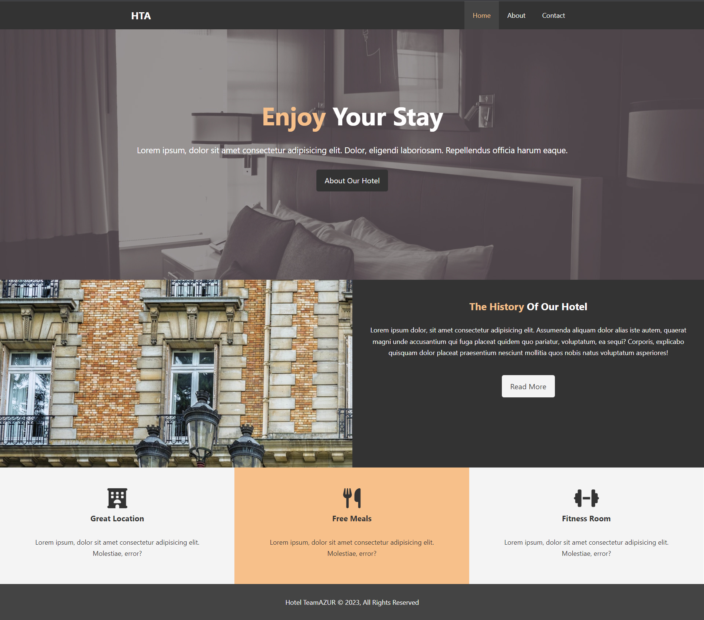
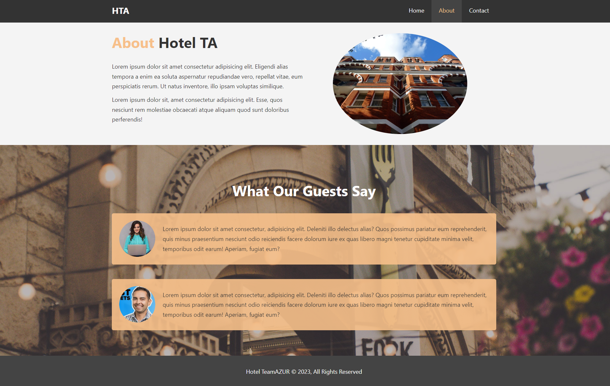
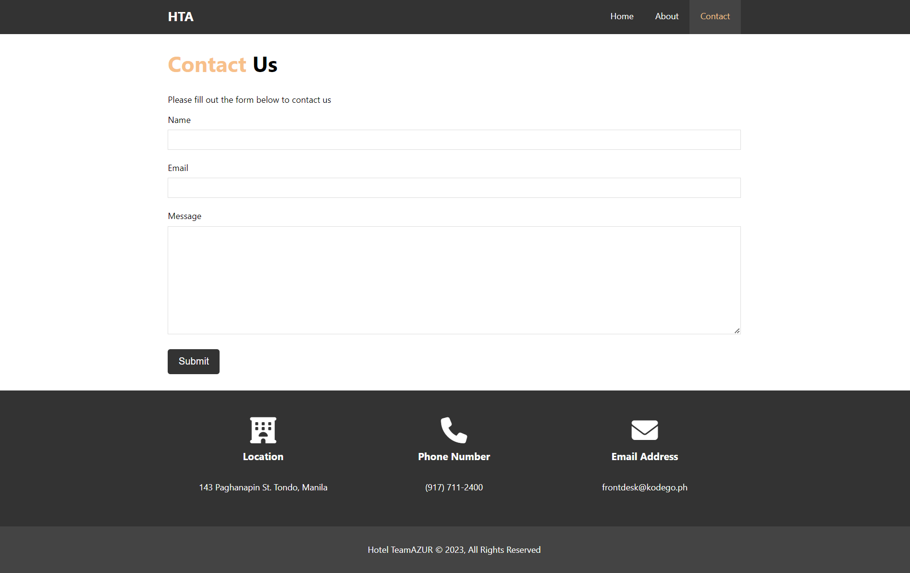
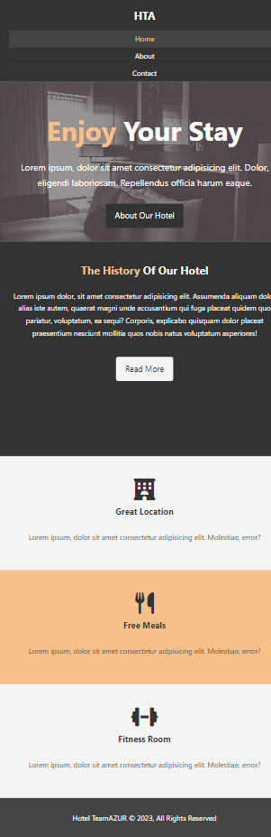

# Hotel Responsive Website

This is a responsive hotel website project built with HTML, CSS, and JavaScript.

## Description

The Hotel Responsive Website project aims to create a visually appealing and user-friendly website for a hotel. It is designed to showcase responsive design techniques and provide a seamless experience across different devices and screen sizes.

The project includes HTML files for the website structure, CSS files for styling, and JavaScript files for interactive functionality.

## Features

- Responsive layout that adapts to different screen sizes (mobile, tablet, desktop).
- Interactive navigation menu with smooth scrolling.
- Image sliders and carousels to showcase hotel rooms and amenities.
- Booking form for making reservations.
- Contact form for inquiries and feedback.

## Demo

You can see a live demo of the Hotel Responsive Website [here](https://adas0mahdi.github.io/03_HotelResponsive/).

## Usage

To use or run the Hotel Responsive Website project locally, follow these steps:

1. Clone the repository to your local machine:

   ```shell
   git clone https://github.com/adas0mahdi/03_HotelResponsive.git


   
Certainly! Here's a sample README file for your "03_HotelResponsive" project:

markdown
Copy code
# Hotel Responsive Website

This is a responsive hotel website project built with HTML, CSS, and JavaScript.

## Description

The Hotel Responsive Website project aims to create a visually appealing and user-friendly website for a hotel. It is designed to showcase responsive design techniques and provide a seamless experience across different devices and screen sizes.

The project includes HTML files for the website structure, CSS files for styling, and JavaScript files for interactive functionality.

## Features

- Responsive layout that adapts to different screen sizes (mobile, tablet, desktop).
- Interactive navigation menu with smooth scrolling.
- Image sliders and carousels to showcase hotel rooms and amenities.
- Booking form for making reservations.
- Contact form for inquiries and feedback.

## Demo

You can see a live demo of the Hotel Responsive Website [here](https://adas0mahdi.github.io/03_HotelResponsive/).

## Usage

To use or run the Hotel Responsive Website project locally, follow these steps:

1. Clone the repository to your local machine:

   ```shell
   git clone https://github.com/adas0mahdi/03_HotelResponsive.git
A. Open the project directory and navigate to the index.html file.

B. Open the index.html file in a web browser to view the website.

Contributing
Contributions are welcome! If you have any improvements, suggestions, or bug fixes, feel free to submit a pull request. Please follow the guidelines outlined in the CONTRIBUTING.md file.

License
This project is licensed under the MIT License. You are free to use, modify, and distribute the code in this repository.

Contact
If you have any questions or suggestions regarding this project, please feel free to contact me.
<br>
<br>
<br>
 
. 






